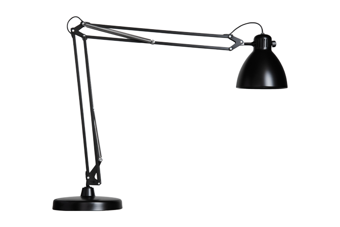

# Lampbot drawings

These drawings were made to modify the original structure and create mounts for servos in such way that the lamp can be articulated in any axis.

The dimensions were based on Luxo L-1 lamp and HS-5765MH servos, any other lamps or servors might not be fit for these drawings.
 

**Note:** Some adjustemnts were made to the parts to fit, that could be caused by my printer overextruding (if the filament diameter changed a bit and I didn't countered this change and just changed dimensions of the parts). It's possible that my drawings are not exact and inherit my workarounds around my printer. Printing these on proper comercial grade printer might not gurantee you perfect fit.

**Note 2:** I apologise if the drawings might look unclean, I'm just learning SolidWorks on short notice and I'm certain they could have be done much more efficiently, but for now this is best I can do :(

## Bottom Motor

Should hold servo motor to move around Z axis and is spaced in such way that the pivot of the servo will align with pivot of the lamp. The files are in SolidWorks and AutoCad as well, but I would recomend as for all others to use SolidWorks or STL (file format often used with 3D printers). The AutoCad was only exported as last backup for somebody who cares only about the footprint and has no access to anything else. But the real objects were designed in SolidWorks and printed from STL files.

I supply the florplan sketches as well just in case somebody wants to replicate these with wood, chisel and glue, some parts could be replicated by other means, not just 3D printing.

The bottom stripes are trenches for the zipties to get stuck in, so the will not slide around the mount.

Lamp Mount
--------
Just replacement for a nilon washer on the bottom of the lamp.

## Middle Bracket

Are the parts to move the elbow axis. First I was making only few experiments to replace the bracket with metal sheet and wanted to confirm the correct dimenstions of the V bracket.

Then it evolved into holding mechanism as well, where I could articulate the arm as well. One aproach was to make a gear and drive it with stepper motor. But then I attempted a direct drive servo aproach. Where the holding V bracket would be turned into thick triangle, have support for the lamp and the servo at the same time.

Original V bracket was 1.5mm thick, if this has any chance to hold same absue while being made from PLA it had to be made much thicker. Because now the bracket is thicker the original shafts might not be long enough to support new thickeness. All except one were fine with the new change. Shaft in one hole had to be replaced with a new screw which is slighly wider than hole, this required increasing one hole by 0.35 mm. This is the reason why original bracket has 5mm holes and the thicker has one hole 5.35mm.

The motor dimenstions were taken from datasheets, some from hand measurements and some just by trial / error to get the parts to fit just right.

 
Some parts took good few iterations to get it right.

### Servo arm

After getting servo mounted I needed to mount arm to it. The servo itself has small gear (15 teeth) which helps with a grip.

On the end of the gear there is smal chamfer to ease the inserting of the arm.

The rest of arm was made to snap around lamps arm, the different lenghts for supports are necesary to avoid colitions with other parts. Up movement is lest restrained, while in downwards movement are other things in the way so it needs to be shorter.

These are the dimensions, the teeth is desribed as triangle with one side 0.85mm long. Be very careful about this lenght. Because 0.05mm is difference between completely lose mount and mount soo tight that you will not able to fit it on. There is little margin for error to get it right and it took me multiple attempts. This might have to be tweaked for different printer because it's possible that I tweaked it around my current conditions instead of the true dimensions.

## Middle gear

This is unfineshed attempt to make half circle gear and drive this with stepper motor. The gears can be done easily in SolidWorks but I encountered other problems related to this aproach and at the moment this aproach is halted. 

But at least you can see how it evolved:

## Conclusion

Even only fraction of my experiments showed any promise, still it was worth the effort. The failed attempts might be fixed, the successful ones might be refined.